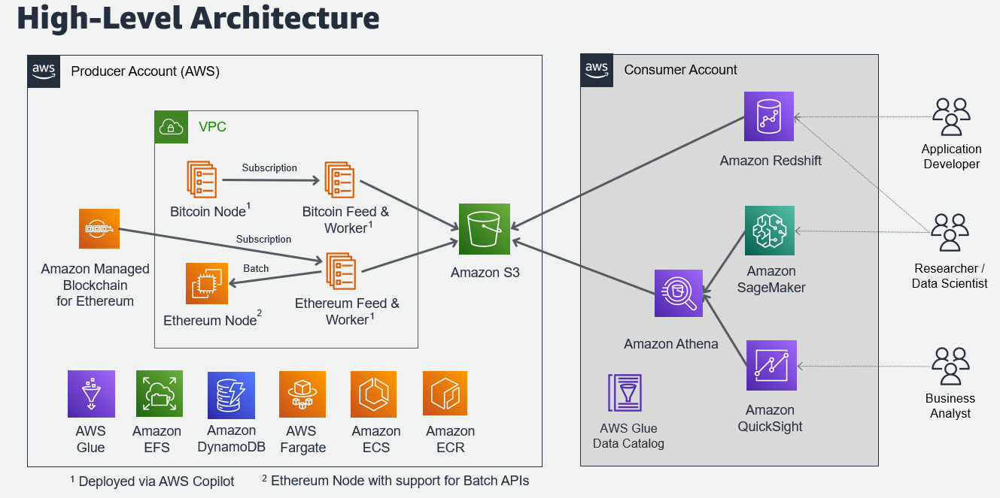
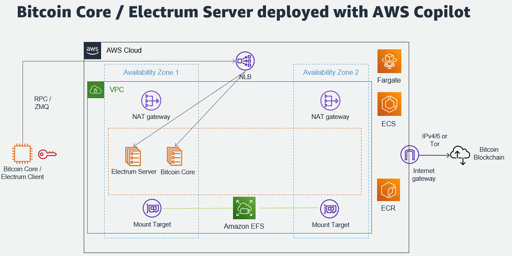

# Digital Assets Examples

This repo contains examples for public blockchain and digital assets use cases on AWS. 

## Bitcoin and Ethereum Blockchain Data

This solution pulls data from the public Bitcoin and Ethereum blockchains and normalizes data into tabular data structures for blocks, transactions, and additional tables for data inside a block. The data is provided as parquet files partioned by date to provide an easy query interface through services like Amazon Athena, Amazon Redshift, and Amazon SageMaker.

Go [here](analytics/README.md) to find out more how to consume this data from AWS or how to set it up in your own AWS account.

## Payments

- Blog Post "Experimenting with Bitcoin Blockchain on AWS": https://aws.amazon.com/blogs/industries/experimenting-with-bitcoin-blockchain-on-aws/

You can find more details [here](payments/README.md).

## Security

See [CONTRIBUTING](CONTRIBUTING.md#security-issue-notifications) for more information.

## License

This library is licensed under the MIT-0 License. See the LICENSE file.