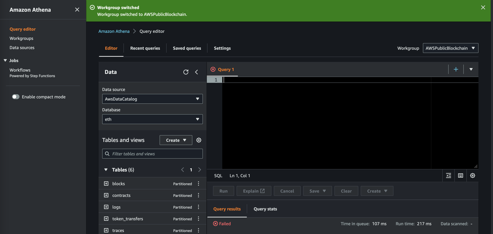
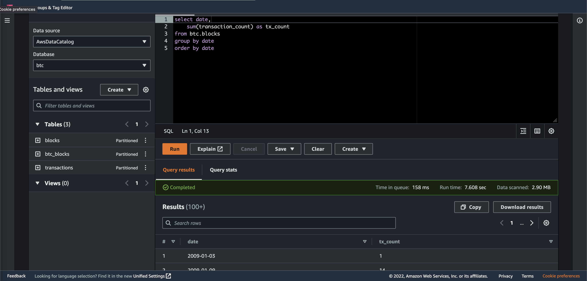
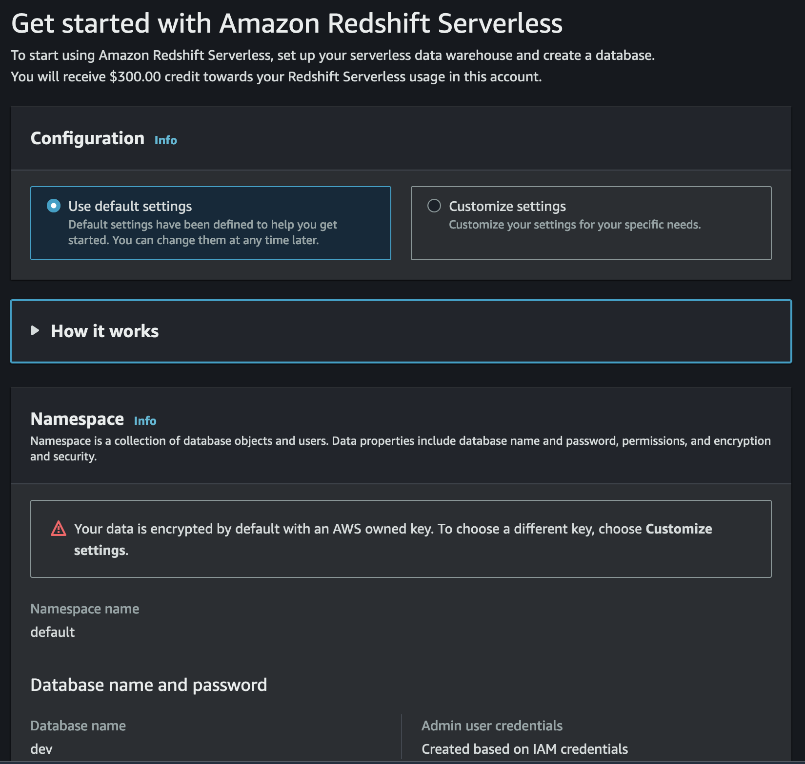
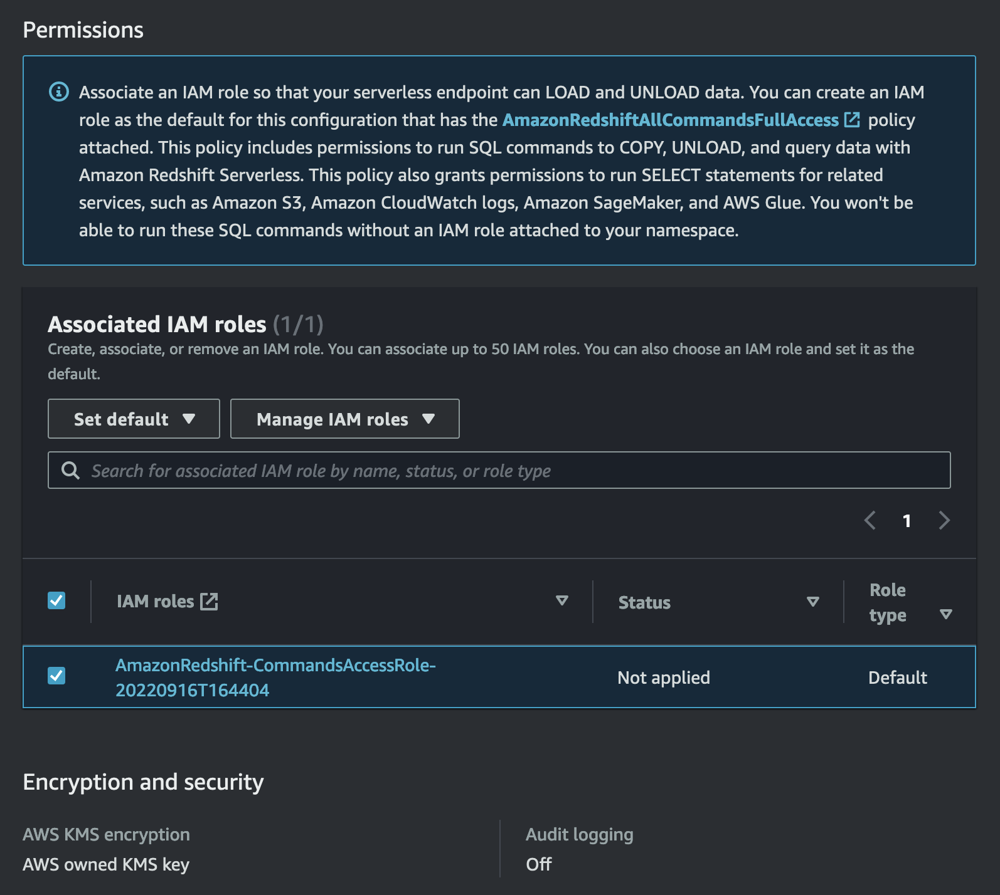
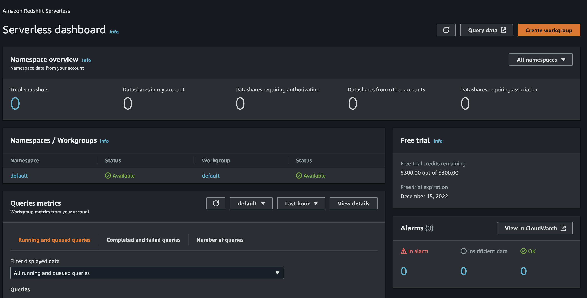
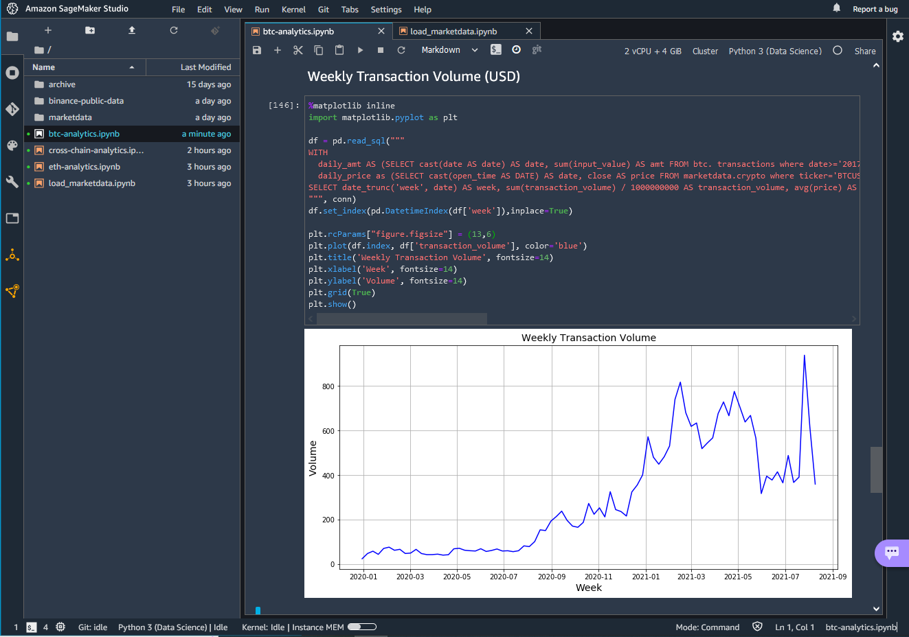

# Bitcoin and Ethereum Blockchain Data

This solution pulls data from the public Bitcoin and Ethereum blockchains and normalizes data into tabular data structures for blocks, transactions, and additional tables for data inside a block. The data is provided as Parquet files partioned by date in Amazon S3 to provide an easy query interface through services like Amazon Athena, Amazon Redshift, and Amazon SageMaker.

## Architecture


## Data

AWS provides Bitcoin and Ethereum blockchain data also in a public Amazon S3 bucket ***aws-public-blockchain*** (us-east-2). Please note that this data is experimental and not recommended for production use cases. You can also choose to run this solution in your own AWS account, in this case you need to replace the name of the public S3 bucket with your own S3 bucket in the following examples. 

Bitcoin: s3://aws-public-blockchain/v1.0/btc/
- blocks/date={YYYY-MM-DD}/{id}.snappy.parquet
- transactions/date={YYYY-MM-DD}/{id}.snappy.parquet

Ethereum: s3://aws-public-blockchain/v1.0/eth/
- blocks/date={YYYY-MM-DD}/{id}.snappy.parquet
- transactions /date={YYYY-MM-DD}/{id}.snappy.parquet
- logs/date={YYYY-MM-DD}/{id}.snappy.parquet
- token_transfers/date={YYYY-MM-DD}/{id}.snappy.parquet
- traces/date={YYYY-MM-DD}/{id}.snappy.parquet
- contracts/date={YYYY-MM-DD}/{id}.snappy.parquet

The schema of the Parquet files is documented for each table and field [here](schema.md).

## How to consume this data

You can access this data directly with the [AWS CLI](https://aws.amazon.com/cli/).

```sh
aws s3 ls --no-sign-request s3://aws-public-blockchain/v1.0/btc/
aws s3 ls --no-sign-request s3://aws-public-blockchain/v1.0/eth/
```

If you want to run SQL queries on this data, we provide a CloudFormation script that deploys Glue table/partition definitions to Glue Data Catalog and configures Athena to be used for SQL queries. By default, the below link will deploy the stack to ***us-east-2*** where the public S3 bucket is located. 

If you only use Athena to query the data, you can deploy it also in another region as Athena supports cross-region access. 

If you want to use Redshift, you need to deploy it to ***us-east-2*** (or the region where the data is hosted) as Redshift Spectrum doesn't support cross-region access currently.

For SageMaker, we can use either Redshift or Athena to access the data. The provided examples use Athena to query the data in a Jupyter notebook. 

If you use your own S3 bucket (bucket name starts with public-blockchain-data), please make sure to specify your S3 bucket as parameter in the following CloudFormation stack and change the region to your region.

[Deploy CloudFormation Stack](https://console.aws.amazon.com/cloudformation/home?region=us-east-2#/stacks/new?stackName=aws-public-blockchain&templateURL=https://aws-blogs-artifacts-public.s3.amazonaws.com/artifacts/DBBLOG-2500/aws-public-blockchain.yaml)

 ## Amazon Athena

 Open Athena and select workgroup ***AWSPublicBlockchain***

 


 


 ## Amazon Redshift

 ### Create Amazon Redshift Serverless database

 Go to the [Amazon Redshift](https://console.aws.amazon.com/redshift/home) console and choose the new serverless option. Confirm all the default settings.



### Associate a new IAM role

Create a new default IAM role and give permissions to access other AWS resources and to be able to load data from a S3 bucket. 




Keep rest of the defaults and create.



### Open query editor and create schema

Replace ***account*** and ***role*** with your details and execute the following statements.

```sql
create external schema btc
from data catalog
database 'btc' 
iam_role 'arn:aws:iam::{account}:role/service-role/{role}'
create external database if not exists;

create external schema eth
from data catalog
database 'eth' 
iam_role 'arn:aws:iam::{account}:role/service-role/{role}'
create external database if not exists;
```


### Start exploring and analyzing the data

```sh
select * from btc.blocks limit 1;
select * from btc.transactions  limit 1;

select * from eth.blocks limit 1;
select * from eth.transactions limit 1;
```


## Amazon SageMaker

Follow the instructions from [here](notebooks.md)



## How to setup this solution in your own AWS account 

Follow the instructions from [here](producer/README.md)

## Security

See [CONTRIBUTING](CONTRIBUTING.md#security-issue-notifications) for more information.

## License

This library is licensed under the MIT-0 License. See the LICENSE file.
