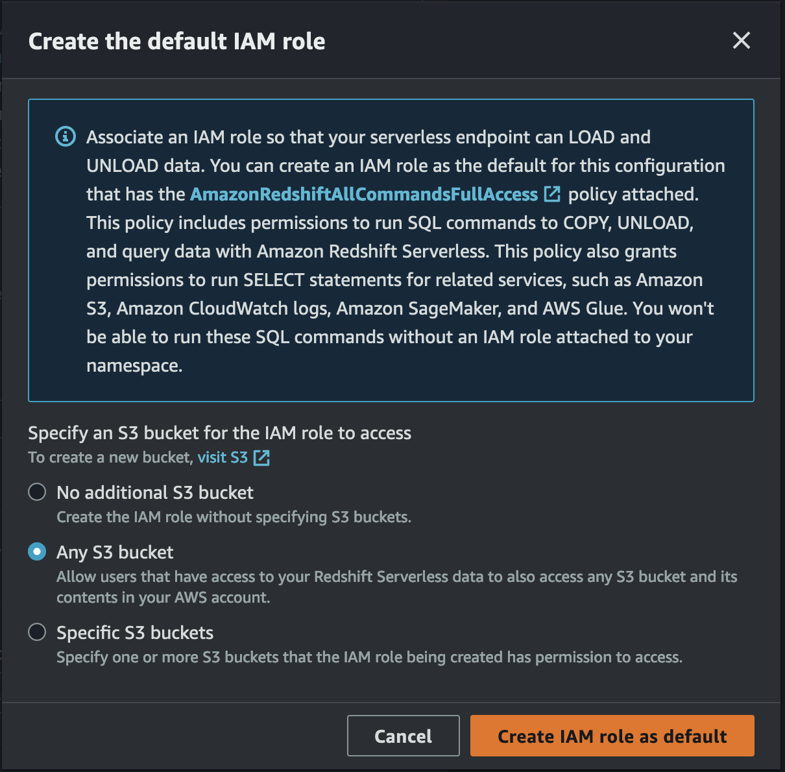
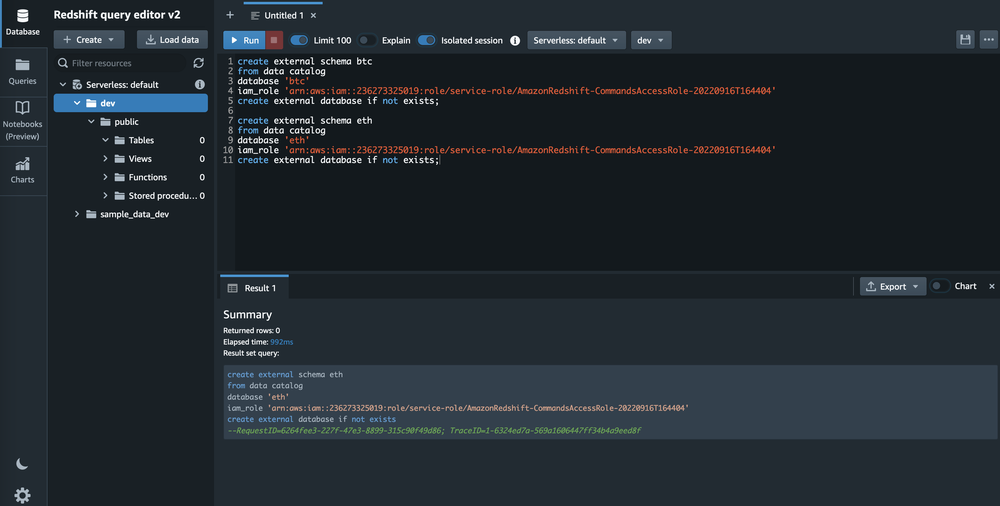
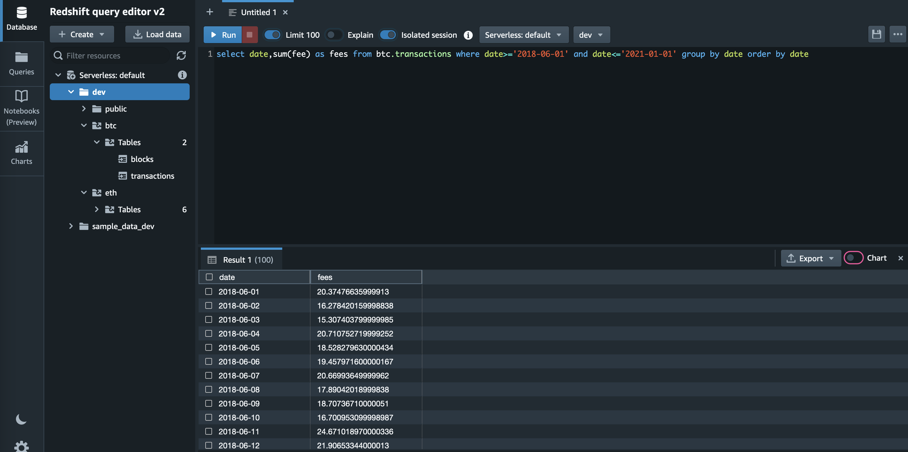

## Bitcoin and Ethereum Blockchains Data

This open-source solution pulls data from the public Bitcoin and Ethereum blockchains and normalizes data into tabular data structures for blocks, transactions, and additional tables for data inside a block. The data is provided as parquet files partioned by date to provide an easy query interface through services like Amazon Athena, Amazon Redshift, and Amazon SageMaker.

## Architecture

### How to consume this data from AWS

You can consume this data using differnt tools like Amazon Athena , Amazon Redshift and Amazon Sagemaker, to get started run the following AWS CloudFormation template in your AWS Account , if you are using Redshift make sure you deploying template in us-east-2 region, for Athena and Sagemaker template can be deployed in any region.

[Deploy Stack](https://console.aws.amazon.com/cloudformation/home?region=us-east-2#/stacks/new?stackName=aws-public-blockchain&templateURL=https://aws-blogs-artifacts-public.s3.amazonaws.com/artifacts/DBBLOG-2500/aws-public-blockchain.yaml)
 
 Above deployment will provision all necessary resources , security , data partitions and tables, now you can use any of the following services to query and do analysis.

 ## Amazon Athena

 Open Athena and select workgroup AWSPublicBlockchain

 

 

 ## Amazon Redshift

 Create Amazon Redshift Serverless database

 Go to the [Amazon Redshift](https://console.aws.amazon.com/redshift/home) console and choose the new serverless option. Confirm all the default settings.

Associate a new IAM roles to give permissions to access other AWS resources and to be able to load data from an S3 bucket - Manual Role 

Keep rest of the defaults and create.

Open Query Editor

Create btc and eth Schema 

Start exploring and analyzing the dat

 ## Amazon Sagemaker

### How to setup this solution in your own AWS account 

Follow the instructions from [here](producer/README.md)

## Security

See [CONTRIBUTING](CONTRIBUTING.md#security-issue-notifications) for more information.

## License

This library is licensed under the MIT-0 License. See the LICENSE file.